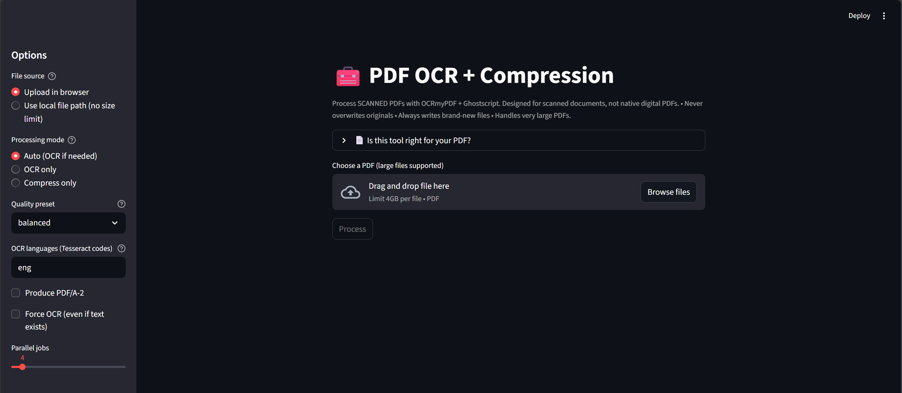
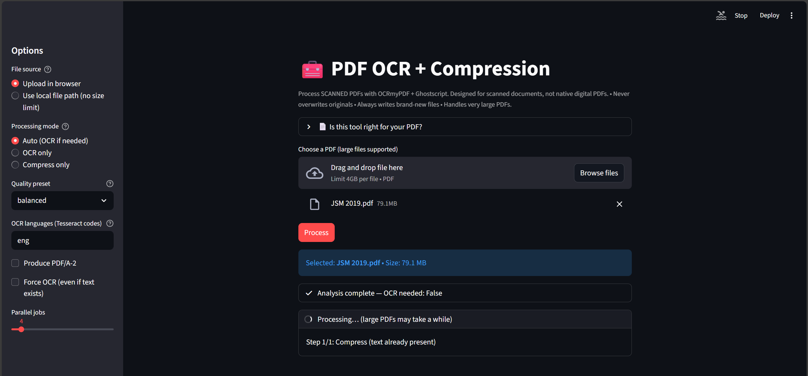
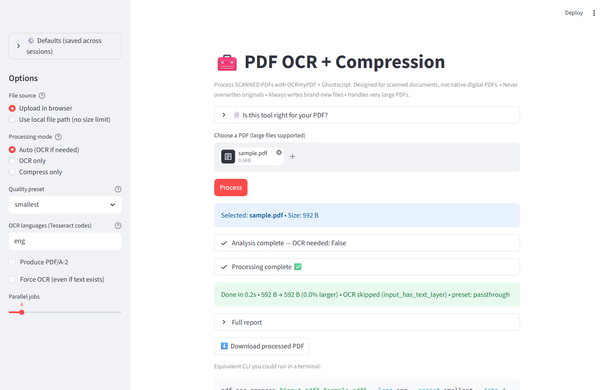

# pdf-ocr-compress

A backend service for turning scanned PDFs into clean, searchable,
RAG-ready files at scale. Wraps OCRmyPDF (Tesseract) and Ghostscript +
pikepdf around a single pipeline, exposed through three first-class
clients:

- **GUI** (Streamlit, single page) — easiest place to start; drag a
  file in, get a processed file out.
- **Docker / REST API** (FastAPI) — the load-bearing surface for
  programmatic use; designed to be called from other apps that
  ingest folders of scanned books into LLM/RAG pipelines.
- **CLI** (Typer) — for scripting and cron jobs.

Single-machine, single-user. No auth, no telemetry, no remote
services.

**Real-world result:** 4.8 GB color textbook scan → 198 MB (-95.9%),
text layer preserved end-to-end. (Sample B from `BENCHMARKS.md`.)

## What it does

- Adds searchable text layers to scanned PDFs via Tesseract OCR.
- Compresses without destroying the OCR text layer (the post-OCR
  Ghostscript pass that strips fonts is explicitly disabled).
- Enforces output ≤ input — never silently grows the file. If the
  requested preset would grow the file, falls back to a working
  preset, or to a passthrough copy if even `smallest` grows it.
- Auto-detects which PDFs already have a text layer and skips OCR
  on those (using a tolerant pikepdf-based check, not pdfminer).
- Folder-batch mode with a per-file retry ladder and a structured
  JSON report.

## Quick start

### Web GUI (easiest)

The GUI is a single Streamlit page with two tabs (Single file,
Batch) and a sidebar for default settings.

```bash
uv sync                # one-time setup; reads pyproject.toml + uv.lock
uv run pdf-ocr-gui     # serves http://localhost:8501
```



Switch to the Batch tab to process a folder of PDFs at once. The
"Browse" buttons open a native folder picker (works because this is
a local-machine app — same machine as the browser).



After processing, the GUI shows a structured report — input vs
output size, which preset was actually used (the size-invariant
guard may have substituted `smallest`), whether OCR ran, and a
post-hoc text-extractability smoke check.



### Docker / backend service

The Docker image runs the GUI and the API together. Compose is the
easiest way:

```bash
docker-compose up
# GUI:      http://localhost:8501
# API:      http://localhost:8502
# API docs: http://localhost:8502/docs   (interactive Swagger UI)
```

To add Tesseract languages, edit the `apt-get install` line in
`Dockerfile` (e.g. `tesseract-ocr-spa tesseract-ocr-fra`) and
rebuild.

**Calling the API from another app?** See [`docs/API.md`](docs/API.md)
for the full endpoint reference, request/response schemas, error
codes, and curl + Python examples.

### Command line

The CLI has four subcommands: `process` (auto-route to OCR or
compress), `ocr`, `compress`, and `batch`.

```bash
# Single file — auto-routes to OCR or compress
uv run pdf-ocr process input.pdf output.pdf

# Folder of PDFs (writes <folder>/processed/ + batch_report.json)
uv run pdf-ocr batch /path/to/scans --preset smallest

# OCR only, with a specific language
uv run pdf-ocr ocr scan.pdf scan_ocr.pdf --lang eng+spa

# Compress only, with a specific preset
uv run pdf-ocr compress big.pdf small.pdf --preset smallest

# See all flags
uv run pdf-ocr --help
```

Batch mode applies the same per-file failure ladder as the API: each
PDF gets an initial attempt, an immediate retry on failure, and one
end-of-batch retry. One bad PDF doesn't kill the rest. The full
report is written to `<output_dir>/batch_report.json` (schema in
[`docs/API.md`](docs/API.md#batchreport-schema)).

## System requirements

- **Python 3.10+** (declared in `pyproject.toml`).
- **Tesseract OCR** on PATH, with the language packs you need.
- **Ghostscript** on PATH (auto-detects `gswin64c` / `gswin32c` /
  `gs`).
- **uv** is recommended; `pip install -r requirements.txt` works
  too. The Docker image installs everything.

### Installing system tools

Windows:

```powershell
winget install UB-Mannheim.TesseractOCR
winget install AGPL.Ghostscript
```

macOS:

```bash
brew install tesseract tesseract-lang ghostscript
```

On Apple Silicon, brew installs to `/opt/homebrew/bin`. Restart your
shell after install if it doesn't pick up the new PATH automatically.

Linux:

```bash
# Debian / Ubuntu
sudo apt install tesseract-ocr ghostscript python3-tk

# Fedora / RHEL
sudo dnf install tesseract ghostscript python3-tkinter

# Arch
sudo pacman -S tesseract tesseract-data-eng ghostscript tk
```

`python3-tk` (or the distro equivalent) is needed for the GUI's
"Browse" folder picker. Without it the picker raises a friendly error
and you'll need to type folder paths by hand. Headless / Docker
environments work fine without it. For other Tesseract languages,
add packages like `tesseract-ocr-spa` (Debian) / `tesseract-langpack-spa`
(Fedora) / `tesseract-data-spa` (Arch).

## Quality presets

Three named presets, defined in `core/compress.py`:

| Preset | Description | Use case |
|---|---|---|
| `smallest` | **Default.** Maximum compression. The only preset that consistently shrinks scanner output across sizes and color depths. | General use; everything that ends up in a RAG corpus. |
| `balanced` | Moderate compression; may grow already-compressed scanner output. | Mixed-content documents. |
| `archival` | Minimal compression; preserves original quality. May significantly grow scanner output. | Legal documents, archival. |

The size-invariant guard runs after every compression pass. If the
requested preset would grow the file, the pipeline falls back to
`smallest`; if even `smallest` would grow the file, the input is
passed through unchanged. The response (or CLI summary) reports the
preset that was actually used in `preset_actually_used`.

## Output naming

All operations create new files with microsecond-precision
timestamps; originals are never overwritten:

- `<stem>_processed_<timestamp>.pdf`
- `<stem>_ocr_<timestamp>.pdf`
- `<stem>_compressed_<timestamp>.pdf`

## Troubleshooting

"Command not found" errors:

- Verify the system tools are reachable: `tesseract --version` and
  `gs --version` (or `gswin64c -v` on Windows).
- On Windows: restart your shell after installing — the new PATH
  entries don't apply to existing sessions.

OCR accuracy issues:

- Scanned documents need at least 300 DPI for reliable OCR.
- Specify the right `--lang` codes for the document's languages.

Output is unexpectedly large:

- The size-invariant guard means the output is never larger than the
  input. If the requested preset would grow the file, the response
  reports `preset_actually_used` set to the fallback that was
  applied. To force a specific preset and fail-loud when it would
  grow the file, set `oversize_policy=fail` (settings or env var).

## License

Provided as-is. Tesseract and Ghostscript carry their own licenses;
ensure you have appropriate rights for your use case.
