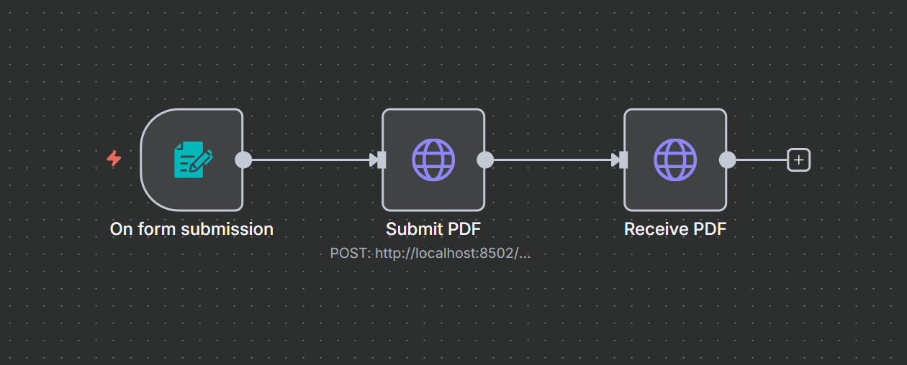

# PDF OCR + Compression Tool

A cross-platform tool for processing **scanned PDFs** with OCR (Optical Character Recognition) and compression. Specifically designed for PDFs created from scanned images/documents.

## PDF Types

This tool is optimized for:

- ✅ **Scanned PDFs**: Created from paper documents, photos, or images
- ✅ **Image-based PDFs**: PDFs containing scanned pages without searchable text
- ✅ **Mixed PDFs**: Some pages scanned, some digital (auto-detects which need OCR)

Not intended for:

- ❌ **Native digital PDFs**: Created directly from Word, Excel, web pages, etc.
- ❌ **Text-based PDFs**: Already containing selectable/searchable text throughout

> **Why this matters**: Native digital PDFs already have searchable text and optimized compression. This tool adds OCR to make scanned images searchable and applies specialized compression for scanned content.

## Screenshots

### Web Interface

Upload and process PDFs through a simple web interface:


Processing in progress:


Results with download:


## Features

- **OCR Processing**: Add searchable text layers to scanned pages using Tesseract OCR
- **Smart Detection**: Automatically detects which pages need OCR vs already have text
- **PDF Compression**: Reduce file sizes with Ghostscript using scanned-document optimizations
- **Safe Operations**: Never overwrites original files - always creates new outputs
- **Multiple Languages**: Support for 100+ languages via Tesseract language packs
- **Cross-Platform**: Works on Windows, macOS, and Linux
- **Simple Web Interface**: Drag, drop, and process PDFs through a browser
- **Command-Line Interface**: Full CLI for automation and batch processing

## Quick Start

### Option 1: Docker (Recommended - No Installation Required)

```bash
# Start the container
docker-compose up

# Access the services
# Web GUI: http://localhost:8501
# REST API: http://localhost:8502
# API Docs: http://localhost:8502/docs
```

### Option 2: Local Installation

#### 1. Install System Dependencies

Windows:

```powershell
# Install Tesseract OCR
winget install UB-Mannheim.TesseractOCR

# Install Ghostscript
winget install AGPL.Ghostscript
```

macOS:

```bash
brew install tesseract tesseract-lang ghostscript
```

Linux (Ubuntu/Debian):

```bash
sudo apt install tesseract-ocr ghostscript
```

### 2. Install Python Dependencies

Option A: Using uv (Recommended)

```bash
# Install uv
pip install uv

# Install all dependencies
uv sync
```

Option B: Using pip

```bash
pip install -r requirements.txt
```

### 3. Run the Application

Web Interface:

```bash
streamlit run src/pdf_ocr_compress/gui/basic.py
```

Command Line:

```bash
# Auto processing (OCR + compression)
python -m pdf_ocr_compress process input.pdf output.pdf

# OCR only
python -m pdf_ocr_compress ocr input.pdf output.pdf --lang eng

# Compression only
python -m pdf_ocr_compress compress input.pdf output.pdf --preset balanced
```

## REST API Usage

The Docker container includes a REST API for programmatic access, perfect for automation tools like n8n, Make, Zapier, or custom scripts.

### API Endpoints

- `POST /api/process` - Process a PDF file
- `GET /api/download/{file_id}` - Download processed file
- `GET /health` - Health check
- `GET /docs` - Interactive API documentation (Swagger UI)

### API Examples

Process a PDF with curl:

```bash
# Process with default settings
curl -X POST "http://localhost:8502/api/process" \
  -F "file=@document.pdf" \
  -F "mode=auto" \
  -F "preset=balanced"

# Response includes file_id for download
{
  "status": "success",
  "file_id": "abc-123-def",
  "mode": "auto",
  "preset": "balanced",
  "original_size": 1048576,
  "output_size": 524288,
  "reduction_percent": 50.0,
  "processing_time": 12.5
}

# Download the processed file
curl "http://localhost:8502/api/download/abc-123-def" \
  -o processed.pdf
```

Process with Python:

```python
import requests

# Upload and process
with open("document.pdf", "rb") as f:
    response = requests.post(
        "http://localhost:8502/api/process",
        files={"file": f},
        data={
            "mode": "auto",
            "preset": "balanced",
            "language": "eng",
            "jobs": 4
        }
    )

result = response.json()
file_id = result["file_id"]

# Download processed file
download_response = requests.get(
    f"http://localhost:8502/api/download/{file_id}"
)

with open("processed.pdf", "wb") as f:
    f.write(download_response.content)
```

### n8n Integration



1. Add **HTTP Request** node
2. Method: `POST`
3. URL: `http://localhost:8502/api/process`
4. Body Content Type: `Multipart-Form`
5. Add fields:
   - `file` (binary data from previous node)
   - `mode` = `auto`
   - `preset` = `balanced`
6. Add second **HTTP Request** node to download using `file_id` from response

See [N8N_BATCH_WORKFLOW.md](N8N_BATCH_WORKFLOW.md) for complete workflow examples including Google Drive and Dropbox integration.

### API Parameters

| Parameter | Type | Default | Description |
|-----------|------|---------|-------------|
| `file` | file | required | PDF file to process |
| `mode` | string | `auto` | Processing mode: `auto`, `ocr`, `compress` |
| `preset` | string | `balanced` | Quality preset: `balanced`, `archival`, `smallest` |
| `language` | string | `eng` | Tesseract language codes (e.g., `eng+spa`) |
| `pdfa` | boolean | `false` | Produce PDF/A-2 compliant output |
| `force_ocr` | boolean | `false` | Force OCR even if text exists |
| `jobs` | integer | `4` | Number of parallel jobs for OCR |

## Usage Examples

### Web Interface

1. Run `streamlit run src/pdf_ocr_compress/gui/basic.py`
2. Open browser to <http://localhost:8501>
3. Upload a PDF file
4. Choose operation (Process, OCR, or Compress)
5. Configure options
6. Click "Start Processing"
7. Download the result

### Command Line Interface

Process a scanned PDF (smart auto-processing):

```bash
python -m pdf_ocr_compress process scanned_document.pdf processed_document.pdf
```

OCR with specific language:

```bash
python -m pdf_ocr_compress ocr document.pdf ocr_output.pdf --lang spa
```

OCR with multiple languages:

```bash
python -m pdf_ocr_compress ocr document.pdf ocr_output.pdf --lang eng+fra+deu
```

Compress with different quality presets:

```bash
# Maximum quality, minimal compression
python -m pdf_ocr_compress compress large.pdf small.pdf --preset archival

# Balanced quality and size (default)
python -m pdf_ocr_compress compress large.pdf small.pdf --preset balanced

# Smallest file size
python -m pdf_ocr_compress compress large.pdf small.pdf --preset smallest
```

## Quality Presets

| Preset | Description | Use Case |
|--------|-------------|----------|
| `archival` | Minimal compression, preserves original quality | Document archival, legal documents |
| `balanced` | High quality with moderate compression | General use, sharing documents |
| `smallest` | Maximum compression for smallest files | Web publishing, email attachments |

## File Output

All operations create new files with timestamps to prevent overwrites:

- OCR outputs: `filename_ocr_20241002-143022.pdf`
- Processed outputs: `filename_processed_20241002-143022.pdf`
- Compressed outputs: `filename_compressed_20241002-143022.pdf`

## Docker Deployment

The easiest way to run this application is with Docker. No system dependencies required!

### Quick Start with Docker

```bash
# Build and run
docker build -t pdf-ocr-compress .
docker run -p 8501:8501 pdf-ocr-compress

# Or use docker-compose
docker-compose up
```

Open browser to <http://localhost:8501>

### Docker with Volume Mounts

Process local files by mounting a directory:

```bash
# Create a directory for PDFs
mkdir pdfs

# Run with volume mount
docker run -p 8501:8501 -v $(pwd)/pdfs:/pdfs pdf-ocr-compress

# Windows (PowerShell)
docker run -p 8501:8501 -v ${PWD}/pdfs:/pdfs pdf-ocr-compress
```

### Docker Compose

```bash
# Start service
docker-compose up -d

# View logs
docker-compose logs -f

# Stop service
docker-compose down
```

### Adding More Languages

The default Docker image includes English only. To add more Tesseract language packs:

```dockerfile
# In Dockerfile, modify the apt-get install line:
RUN apt-get update && apt-get install -y --no-install-recommends \
    tesseract-ocr \
    tesseract-ocr-eng \
    tesseract-ocr-spa \
    tesseract-ocr-fra \
    tesseract-ocr-deu \
    ghostscript \
    && rm -rf /var/lib/apt/lists/*
```

### Deployment Options

Docker containers can be deployed to:

- **Home Servers**: NAS (Synology, Unraid, TrueNAS)
- **Cloud Platforms**: AWS ECS, Google Cloud Run, Azure Container Instances
- **PaaS Services**: Fly.io, Railway, Render.com
- **Self-hosted**: Docker Compose, Kubernetes

## System Requirements

### Local Installation

- **Operating System**: Windows 10/11, macOS 10.14+, or Linux (Ubuntu 18.04+)
- **Python 3.9+** (required by latest ocrmypdf)
- **Tesseract OCR** (with language packs)
- **Ghostscript** (for PDF processing)

### Docker Installation

- **Docker** 20.10+ or **Docker Desktop**
- **Docker Compose** 2.0+ (optional, included with Docker Desktop)
- **System**: 2GB RAM minimum, 4GB recommended
- **Disk**: ~1GB for Docker image

## Troubleshooting

"Command not found" errors:

Windows:

- Ensure Tesseract and Ghostscript are installed and in your PATH
- Restart PowerShell/Command Prompt after installation
- Verify: `tesseract --version` and `gswin64c -v`

macOS/Linux:

- Check installation: `tesseract --version` and `gs --version`
- Ensure Homebrew/package manager installation completed successfully
- Try reinstalling with the provided commands

Large file processing:

- Use the web interface for files >100MB
- For very large files (>500MB), use CLI for better memory management

OCR accuracy issues:

- Ensure scanned documents have good resolution (300 DPI minimum)
- Use appropriate language codes for your documents
- Consider preprocessing images for better OCR results

## Dependencies

### Python Packages

- `ocrmypdf>=15.0.0` - OCR processing wrapper
- `pikepdf>=8.0.0` - PDF manipulation
- `pdfminer.six>=20221105` - Text extraction
- `typer>=0.12.0` - CLI framework
- `rich>=13.0.0` - Terminal output
- `streamlit>=1.32.0` - Web interface

### System Tools

- **Tesseract OCR** - Text recognition engine with language pack support
- **Ghostscript** - Cross-platform PDF processing and compression
- **FastAPI** (optional) - REST API for programmatic access
- **Uvicorn** (optional) - ASGI server for FastAPI

## License

This project is provided as-is for PDF processing needs. Please ensure you have appropriate licenses for Tesseract OCR and Ghostscript for your use case.
